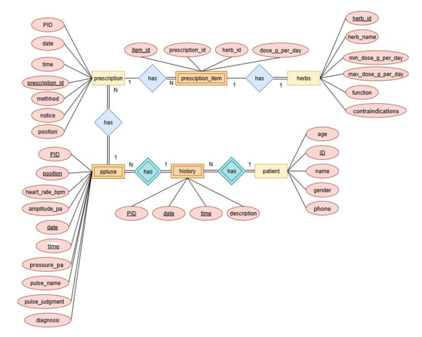

# 中醫脈診醫療資訊系統 — 雲端網頁與資料庫端

**Chinese Medicine Pulse Diagnosis Medical Information System — Cloud Web & Database**

**國立臺南大學資訊工程學系 115 級畢業專題 ｜ 專案編號：NUTN-CSIE-PRJ-115-010**

---

## 專案簡介

傳統中醫脈診高度依賴醫師的主觀觸感經驗，長期面臨**缺乏客觀量測標準**、**可複製性低**與**教學門檻高**三大問題。本專題嘗試以嵌入式系統、訊號處理與 AI 技術，將脈診過程數位化、客觀化與標準化。

完整系統由四個部分組成，**本 repo 為其中的「雲端網頁與資料庫端」**：

| 組成 | 職責 | 位置 |
| :--- | :--- | :--- |
| 前置資料處理（離線） | 文獻脈波圖轉 CSV、資料擴增，產出標準脈象指紋數據庫 | [Pulse2CSV](https://github.com/Mintszebra/Pulse2CSV) |
| 自製診脈儀（韌體） | Raspberry Pi Pico 2 W + 氣動控制 + 壓力感測，模擬寸關尺三部與浮中沉三層按壓 | [blood-pulse-sampler](https://github.com/Doner357/blood-pulse-sampler) |
| 本地端客戶端 | PyQt6 桌面程式：BLE 連線、即時繪圖、兩階段混合式 AI 分析、報告上傳 | [tcm-pulse-local-client](https://github.com/Mintszebra/tcm-pulse-local-client)|
| **雲端網站與資料庫** | **Flask + MySQL，提供病歷建立、查詢與管理** | **本 repo**|

本專案為「中醫脈診醫療資訊系統」的雲端資料管理與網頁前端模組。系統基於 Python Flask 微框架開發，並搭配 MySQL 資料庫，提供視覺化的病歷查詢、建立與管理功能，旨在實現中醫診斷數據的雲端化與結構化儲存，並作為本地端診脈儀與 AI 分析引擎的強大後盾。

## 展示影片

## 🛠 核心技術棧

* **後端框架**：Python Flask
* **資料庫**：MySQL（透過 `pymysql` 函式庫操作，統一使用 `DictCursor` 以提升後端資料處理效率）
* **前端互動**：Vanilla JavaScript (Fetch API)
* **資料同步機制**：採用前端定時輪詢 (Polling) 機制，確保在共享主機 (如 PythonAnywhere) 環境下的資料傳輸穩定性

## ✨ 核心網頁功能模組

### 1. 資料查詢系統 (`/query`)
* 提供視覺化查詢介面，使用者輸入病患身分證號即可獲取完整病患基本資料。
* 系統會動態載入該病患所有的歷史看診時間點於下拉選單中。
* 選擇特定看診紀錄後，可詳細檢視該次看診的寸、關、尺三部脈診數據（如心率、振幅）以及 AI 輔助開立的處方與藥材建議。
* **技術亮點**：後端 API 透過複雜的 `LEFT JOIN` 一次性從多個關聯表格獲取數據，並在 Python 端將扁平結果轉換為巢狀 JSON 供前端動態渲染。

### 2. 病歷建立與即時資料同步 (`/create`)
* 頁面載入時自動填入當前系統日期與時間，簡化即時記錄流程。
* **硬體資料連動**：前端具備定時輪詢機制（每 3 秒自動向 `/api/get-latest-analysis` 發送 GET 請求），能自動接收由本地端診脈儀推播上來的最新 AI 分析報告，並自動填入對應的表單欄位。
* 操作人員僅需核對自動填入的客觀數據，並補充病患的主觀症狀即可送出建檔。

### 3. 病患基本資料管理 (`/new-patient`)
* 專屬的病患建檔介面，包含身分證號、姓名、性別、年齡與電話等必填欄位。
* 具備前端即時格式驗證（如身分證號邏輯檢核），確保所有資料符合規範後才允許提交並寫入資料庫。

### 4. 內建後端資料庫管理器 (`/db-viewer`)
* 專為開發與管理人員打造的視覺化資料庫維護工具。
* 支援透過下拉選單切換系統中的任何表格（如 patient, history, herbs），並提供完整的 CRUD（新增、讀取、修改、刪除）功能。
* 大幅降低於雲端部署環境下，需透過 Bash 終端機輸入 SQL 語法進行資料維護的難度。

## 🗄️ 資料庫架構設計 (ERD)

  

本系統資料庫嚴格遵循第三正規化 (3NF) 設計，以最大限度減少資料冗餘並避免更新異常：

* **`patient` (病患表)**：儲存病患靜態基本資料，以身分證號 (`ID`) 為主鍵。
* **`history` (看診紀錄表)**：記錄每次看診事件。為確保精確識別單日多次看診，採用 `(PID, date, time)` 作為複合主鍵。
* **`ppluse` (脈診資訊表)**：存放該次看診中，特定部位 (寸/關/尺) 的客觀脈診數據與判斷結果，透過 `(PID, date, time, position)` 與 `history` 建立關聯。
* **處方與藥材管理 (多對多關係解析)**：
  * **`prescription`**：與特定脈診資訊掛鉤，儲存煎服方法與注意事項。
  * **`herbs`**：獨立儲存系統中的藥材屬性清單（包含功效與禁忌）。
  * **`prescription_item`**：作為關聯實體 (Associative Entity)，完美解析處方與藥材的多對多關係，並精確儲存每項藥材在該處方中的每日專屬劑量 (`dose_g_per_day`)。

## ⚙️ 系統部署與整合
* 本地端應用程式分析完畢後，會將結構化報告發送 HTTP POST 請求至本網站的 `/api/push-analysis` 暫存。
* 多資料表寫入時（如提交病歷），後端嚴格執行資料庫事務，統一透過 `connection.commit()` 提交，確保跨表資料寫入的絕對一致性。

## 參考文獻

1. 《脈經》— 中國哲學書電子化計劃：<https://ctext.org/wiki.pl?if=gb&res=188522>
2. Shu, J.-J., & Sun, Y. (2007). *Developing classification indices for Chinese pulse diagnosis*, 15(3).
3. 衛生福利部中醫藥司 — 脈診波形：<https://dep.mohw.gov.tw/DOCMAP/cp-801-7124-108.html>
4. 王桂茂，《自學診脈一本通〔圖解版〕》
5. 張仲尹，《基於中醫把脈之脈象量測系統開發與分析》，台科大，2017
6. 林康平，《以連續恆壓施壓為基礎之可攜式中醫脈診量測系統應用研究》，中醫藥年報第 27 期第 6 冊
7. Zhao, Y., et al. *Wearable multichannel-active pressurized pulse sensing platform*
8. 《臺灣中藥典》第四版 — 衛生福利部編印
9. TCA9548A Datasheet：<https://www.ti.com/lit/ds/symlink/tca9548a.pdf>
10. Raspberry Pi Pico 2 W Datasheet：<https://datasheets.raspberrypi.com/picow/pico-2-w-datasheet.pdf>
11. XGZP6857D Datasheet：<https://cfsensor.com/wp-content/uploads/2022/11/XGZP6857D-Pressure-Sensor-V2.9.pdf>
12. Building a Bluetooth GATT Server on the Pi Pico W：<https://vanhunteradams.com/Pico/BLE/GATT_Server.html>
