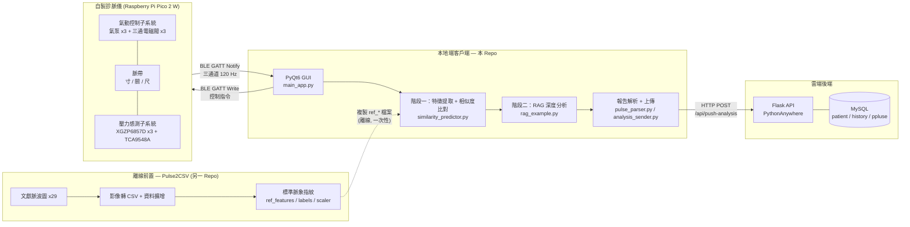
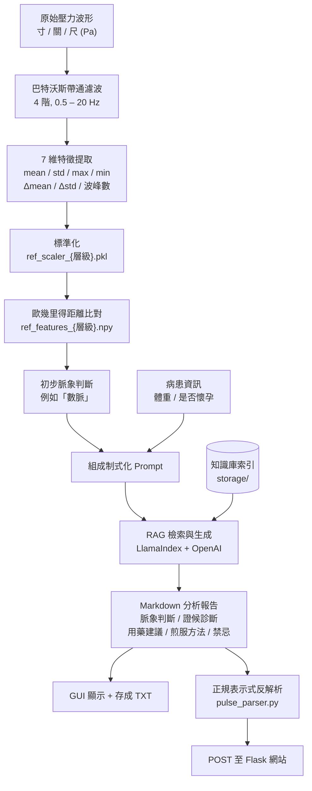

<div align="center">

# 中醫脈診醫療資訊系統 — 本地端客戶端

**Chinese Medicine Pulse Diagnosis Medical Information System — Local Client**

國立臺南大學資訊工程學系 115 級畢業專題 ｜ 專案編號：NUTN-CSIE-PRJ-115-010

[](https://www.python.org/)
[](https://pypi.org/project/PyQt6/)
[](https://github.com/hbldh/bleak)
[](https://www.llamaindex.ai/)
[](https://youtu.be/N_DbZlq5FkQ)

</div>

---

> [!WARNING]
> **醫療免責聲明**
>
> 本專案為**學術研究與教學用途之原型系統**，尚未經過臨床驗證，亦非核准之醫療器材。系統產生的脈象判斷、證候診斷與用藥建議由大型語言模型生成，**其準確性未經專業中醫師之臨床比對與統計驗證**，任何輸出結果均不得作為診斷、處方或治療之依據。如有身體不適，請諮詢合格之醫師。

---

## 專案簡介

傳統中醫脈診高度依賴醫師的主觀觸感經驗，長期面臨**缺乏客觀量測標準**、**可複製性低**與**教學門檻高**三大問題。本專題嘗試以嵌入式系統、訊號處理與 AI 技術，將脈診過程數位化、客觀化與標準化。

完整系統由四個部分組成，**本 repo 為其中的「本地端客戶端」**：

| 組成 | 職責 | 位置 |
| :--- | :--- | :--- |
| 前置資料處理（離線） | 文獻脈波圖轉 CSV、資料擴增，產出標準脈象指紋數據庫 | [Pulse2CSV](https://github.com/Mintszebra/Pulse2CSV) |
| 自製診脈儀（韌體） | Raspberry Pi Pico 2 W + 氣動控制 + 壓力感測，模擬寸關尺三部與浮中沉三層按壓 | 另一 repo |
| **本地端客戶端** | **PyQt6 桌面程式：BLE 連線、即時繪圖、兩階段混合式 AI 分析、報告上傳** | **本 repo** |
| 雲端網站與資料庫 | Flask + MySQL，提供病歷建立、查詢與管理 | 另一 repo |

> [!NOTE]
> 本 repo 內的 `ref_features_*.npy` / `ref_labels_*.json` / `ref_scaler_*.pkl` 為 [Pulse2CSV](https://github.com/Mintszebra/Pulse2CSV) 的產出物，直接複製過來供執行期載入，**本 repo 不負責產生它們**。

客戶端的核心是一套**兩階段混合式 AI 引擎**：第一階段由訊號處理與相似度比對進行快速、可重現的初步脈象判斷；第二階段將該結果與病患資訊組成查詢指令，交由 RAG（檢索增強生成）系統從中醫典籍知識庫中生成含個人化劑量建議的完整報告。此架構讓每一次診斷都能追溯回其知識來源，避免傳統深度學習模型的黑盒問題。

## 展示影片

[](https://youtu.be/N_DbZlq5FkQ)

## 系統架構



## 分析流程



## 功能特色

- **BLE 無線通訊** — 透過 `bleak` 與自製診脈儀建立 GATT 連線，非同步事件迴圈跑在獨立執行緒，不阻塞 GUI 主執行緒。
- **即時三通道波形繪製** — 以 `pyqtgraph` 同步顯示寸、關、尺三部的壓力波形。
- **虛擬設備模式** — 內建 `FakePulseMonitor`，無硬體時即可完整跑通整條分析流程，方便開發與展示。
- **可重現的初步判斷** — 濾波、特徵提取、標準化與歐氏距離比對皆為確定性演算法，同一段波形永遠得到同一個初步脈象。
- **可追溯的深度分析** — RAG 引擎的每一次回答都源自知識庫中的具體文本；更新知識只需修改 `data/` 內的文件並重建索引，無須重新訓練模型。
- **個人化用藥建議** — 將體重、是否懷孕等病患資訊納入 Prompt，由 RAG 產出對應的藥材與劑量。
- **背景執行緒查詢** — RAG 查詢透過 `QThread` + `RAGWorker` 在背景執行，測量結束後 UI 不會凍結。
- **自動上傳雲端** — 報告經正規表示式反解析為結構化 JSON 後，自動 POST 至 Flask 網站的暫存 API，網站端 `/create` 頁面以輪詢機制自動填入表單。

## 環境需求

### 硬體（選用）

無硬體時可勾選「使用虛擬設備」以模擬模式運作。

| 項目 | 型號 | 數量 | 說明 |
| :--- | :--- | :--- | :--- |
| 微控制器 | Raspberry Pi Pico 2 W | 1 | 150 MHz 雙核 / 520 KB SRAM / BLE 5.2 |
| 壓力感測器 | XGZP6857D | 3 | 0 – 100 kPa，內建 ADC 與溫度補償 |
| I²C 多工器 | TCA9548A | 1 | 解決三顆感測器 I²C 位址衝突 |
| 氣泵 | EDZP2 | 3 | 4 V / 0.2 A |
| 三通電磁閥 | JQF0815C | 3 | 4 V / 0.2 A |
| 驅動與保護 | IRLZ44N + 1N4007 | 6 組 | 邏輯準位 MOSFET + 續流二極體 |

韌體以 FreeRTOS 實作，採「管線化讀取」策略達成每 8.33 ms（120 Hz）三通道同步採樣。

### 軟體

- **Python 3.13**（見 `.python-version`；專題報告的開發環境為 3.11.1，3.11 以上應可運作）
- **OpenAI API Key**（RAG 階段使用 `o3` 與 `text-embedding-ada-002`）
- 具備藍牙低功耗（BLE）功能的主機（僅在使用真實硬體時需要）

## 安裝

```bash
git clone https://github.com/Mintszebra/tcm-pulse-local-client.git
cd tcm-pulse-local-client
```

建立虛擬環境並安裝相依套件：

```bash
python -m venv .venv

# Windows
.venv\Scripts\activate
# macOS / Linux
source .venv/bin/activate

pip install -r requirements.txt
```

> [!NOTE]
> `requirements.txt` 是在 Windows 環境下 `pip freeze` 產生的，內含 `winrt-*` 系列套件，在 macOS / Linux 上安裝會失敗。非 Windows 平台請改以核心套件安裝：
>
> ```bash
> pip install PyQt6 pyqtgraph bleak numpy pandas scipy scikit-learn joblib \
>             markdown requests python-dotenv tqdm \
>             llama-index llama-index-llms-openai llama-index-embeddings-openai
> ```

## 設定

在專案根目錄建立 `.env` 檔案，填入 OpenAI API 金鑰：

```bash
OPENAI_API_KEY=sk-xxxxxxxxxxxxxxxxxxxxxxxxxxxxxxxx
```

`.env` 已列入 `.gitignore`，不會被提交至版本控制。

## 執行

```bash
python main_app.py
```

程式啟動時會先初始化 RAG 知識庫（若 `storage/` 已存在則直接載入既有索引），完成後即可操作。

### 使用步驟

1. **選擇設備** — 勾選「使用虛擬設備」進行模擬，或點擊「掃描附近設備」後從清單選取實體診脈儀，再按「連接選定設備」。
2. **設定測量參數** — 設定測量時長（5 – 60 秒，預設 20 秒）與測量壓力層級（浮 / 中 / 沉，預設「中」）。使用虛擬設備時，可另外選擇要模擬的脈象模式。
3. **輸入患者資訊** — 填入體重（kg），若為孕婦請勾選，此資訊會影響 RAG 產出的藥材與劑量建議。
4. **開始測量** — 儀器會先進入 `INFLATING` 狀態調整壓力，穩定後自動轉為 `MEASURING` 並即時回傳三通道波形。
5. **查看分析報告** — 測量結束後系統自動執行初步比對與 RAG 深度分析，報告顯示於右上角欄位，並可「儲存分析報告為 TXT」。同時會自動產生 `pulse_distance_report_{時間戳}.txt` 記錄相似度距離明細。
6. **上傳雲端** — 分析結果會自動 POST 至網站的 `/create` 頁面，於網站補上病患身分證號與自述症狀後即可提交入庫。

實際使用時，需將三條壓脈帶的氣囊分別對準手腕的寸、關、尺三個位置（準確位置因人而異）。

## 專案結構

```text
tcm-pulse-local-client/
├── main_app.py                   # PyQt6 主程式：GUI、即時繪圖、分析流程調度、RAG 背景執行緒
├── pulse_monitor_interface.py    # 抽象介面 (API Contract)：DeviceStatus / SensorDataPoint / PressureLevel
├── real_pulse_monitor.py         # BLE 實作：以 bleak 與 Pico 2 W 診脈儀通訊
├── fake_pulse_monitor.py         # 虛擬設備：以數學模型合成脈搏波形
├── similarity_predictor.py       # 訊號處理：帶通濾波、7 維特徵提取、指紋數據庫建立與歐氏距離比對
├── rag_example.py                # RAG 引擎：LlamaIndex 索引建立、查詢與 CLI
├── pulse_parser.py               # 將 RAG 純文字報告反解析為結構化 dict
├── analysis_sender.py            # 將解析結果 POST 至 Flask 網站
├── data_structures.py            # DiagnosisResult dataclass
│
├── ref_features_{浮,中,沉}.npy    # 標準脈象指紋：標準化後的特徵向量矩陣 ┐
├── ref_labels_{浮,中,沉}.json     # 指紋對應的脈象標籤                   ├ 由 Pulse2CSV 產出
├── ref_scaler_{浮,中,沉}.pkl      # 各層級的 StandardScaler 模型         ┘
│
├── 脈搏症狀.csv                   # 29 種脈象 x 寸關尺 x 左右手 的主治對應表
├── medicine.csv                  # 症狀 → 建議中藥材 / 分類 / 副作用 / 不適用人群
├── sample.txt, test.txt          # RAG 報告範例，供 pulse_parser 測試
├── test_push.py                  # 以 test.txt 測試上傳流程
│
├── data/                         # RAG 知識庫來源文件
│   └── tcm_knowledge_base.txt
├── storage/                      # LlamaIndex 持久化向量索引
│
├── tcm_analyzer.py               # (遺留) 早期規則式／模型分析器
├── gui_tester.py                 # (遺留) 早期 tkinter 測試介面
├── requirements.txt              # 相依套件（Windows pip freeze）
├── .python-version               # 3.13
└── 中醫師畢業專題報告.pdf          # 完整專題報告書
```

## 核心模組說明

| 模組 | 關鍵函式 / 類別 | 說明 |
| :--- | :--- | :--- |
| `pulse_monitor_interface.py` | `PulseDiagnosisInterface` | 抽象基底類別，定義 `scan_for_devices` / `connect` / `set_pressure_levels_pa` / `start_measurement_by_level` / `start_measurement_by_profile` / `stop_measurement` / `reset` / `register_event_callback` / `shutdown` 等契約。真實與虛擬設備皆實作此介面，GUI 因此可無痛切換。 |
| `real_pulse_monitor.py` | `RealPulseMonitor` | 在背景執行緒跑 `asyncio` 事件迴圈，以 `BleakScanner` / `BleakClient` 完成掃描、連線、寫入指令與訂閱通知。 |
| `fake_pulse_monitor.py` | `FakePulseMonitor` | 以升降指數函數合成擬真脈搏波，並依模擬模式動態調整心率與振幅。 |
| `similarity_predictor.py` | `extract_features` | 依時間戳推算真實取樣率，套用 4 階 0.5 – 20 Hz 巴特沃斯帶通濾波去除基線漂移與雜訊，再以 `find_peaks`（同時設定 `height` / `prominence` / `distance`）穩健偵測波峰，輸出 7 維特徵向量。 |
| | `create_all_databases` | 遍歷樣本資料夾，為浮 / 中 / 沉三個層級各建立一套 `.npy` / `.json` / `.pkl` 指紋數據庫。 |
| | `find_most_similar` | 標準化即時特徵後，計算與所有標準樣本的歐幾里得距離，取距離最小者作為初步判斷。 |
| `rag_example.py` | `RAGApplication` | 以 `SimpleDirectoryReader` 讀取 `data/`，`SentenceSplitter`（chunk 512 / overlap 50）切分後建立 `VectorStoreIndex` 並持久化至 `storage/`；查詢採 `tree_summarize` 模式、`similarity_top_k=3`。 |
| `main_app.py` | `PulseMonitorGUI` | 主視窗，負責 UI、訊號槽連接、繪圖緩衝（`deque`，最多 500 點）與整合分析流程。 |
| | `RAGWorker` | 移入 `QThread` 的背景 worker，透過 `pyqtSignal` 收發查詢與結果。 |
| `pulse_parser.py` | `parse_pulse_report` | 以正規表示式將報告切成寸 / 關 / 尺三段，抽出心率、振幅、平均壓力、脈象判斷、證候診斷、藥材表格、煎服方法與禁忌事項。 |

## BLE 通訊協定

診脈儀作為 GATT Server，客戶端為 GATT Client。

| 角色 | UUID | 屬性 |
| :--- | :--- | :--- |
| Service | `652C47C0-C653-41BC-8828-30200EF3350A` | — |
| Command | `652C47C1-C653-41BC-8828-30200EF3350A` | Write |
| Machine Status | `652C47C2-C653-41BC-8828-30200EF3350A` | Notify |
| Pulse Value | `652C47C3-C653-41BC-8828-30200EF3350A` | Notify |

**控制指令**

| 指令 | 值 | 說明 |
| :--- | :--- | :--- |
| `STOP_SAMPLING` | `0x01` | 停止採樣，回到待機（不釋放壓力） |
| `START_SAMPLING` | `0x02` | 開始採樣並回傳脈搏資料 |
| `SET_PRESSURE` | `0x03` | 設定目標壓力，進入壓力調節狀態 |
| `RESET` | `0x04` | 目標壓力歸零，強制回到待機 |

**狀態機**

| 韌體狀態 | 值 | 客戶端對應 `DeviceStatus` | 說明 |
| :--- | :--- | :--- | :--- |
| `IDLE` | `0x01` | `CONNECTED_IDLE` | 待機，等待指令 |
| `SAMPLING` | `0x02` | `MEASURING` | 採樣中，不可設定壓力 |
| `SETTING_PRESSURE` | `0x03` | `INFLATING` | 調節壓力中，壓力到達後自動回到 Idle |

**壓力層級對應**

| 層級 | Enum | 目標壓力 | 約略換算 |
| :--- | :--- | ---: | ---: |
| 浮 | `FLOATING` | 10,665 Pa | ≈ 80 mmHg |
| 中 | `MIDDLE` | 15,998 Pa | ≈ 120 mmHg |
| 沉 | `SINKING` | 21,331 Pa | ≈ 160 mmHg |

客戶端另設有 `MAX_PRESSURE_PA = 90,000` 的軟體安全上限。

## 脈象指紋數據庫

每個壓力層級各自擁有一套獨立的指紋數據庫。這些指紋**並非由本 repo 產生**，而是在前置專案 [**Pulse2CSV**](https://github.com/Mintszebra/Pulse2CSV) 中離線完成後複製過來的；本 repo 只負責在執行期載入並比對。

其產線為：文獻脈波圖（29 張 PNG）→ `readmaibo.py` 以 OpenCV HSV 遮罩擷取波形座標轉為 CSV → `csv2png.py` 重繪回圖檔供目視驗證 → 依壓力層級分入 `pulse_data/{浮,中,沉}/` → `augment_csv_batch.py` 以抖動（Jittering）、縮放（Scaling）與窗口切片（Window Slicing）將每個樣本擴增為 50 筆 → `create_all_databases()` 提取特徵、標準化並存成 `.npy` / `.json` / `.pkl`。

| 壓力層級 | 樣本數 | 脈象類別 | 涵蓋脈象 |
| :--- | ---: | ---: | :--- |
| 浮 | 350 | 7 | 浮、濡、芤、革、散、虛、平 |
| 中 | 900 | 18 | 洪、遲、緩、澀、結、數、疾、促、動、微、細、代、短、實、長、滑、弦、緊 |
| 沉 | 200 | 4 | 沉、伏、牢、弱 |
| **合計** | **1,450** | **29** | 對應 `脈搏症狀.csv` 所收錄之 29 種脈象 |

**7 維特徵向量**

| # | 特徵 | 意義 |
| :--- | :--- | :--- |
| 1 | `mean_y` | 壓力平均值 — 對應「浮 / 沉」 |
| 2 | `std_y` | 壓力標準差 — 反映穩定度 |
| 3 | `max_y` | 壓力最大值 |
| 4 | `min_y` | 壓力最小值（與 `max_y` 共同對應「虛 / 實」振幅） |
| 5 | `mean_diff` | 一階差分平均 — 平均變化率 |
| 6 | `std_diff` | 一階差分標準差 — 反映波形銳利度 |
| 7 | `num_peaks` | 主要波峰數量 — 對應「遲 / 數」心率 |

### 重建指紋數據庫

原始脈波圖與各階段的中間產物（`maibo/`、`maibo_csv_results/`、`pulse_data/`、`pulse_data_augmented/`）皆存放於 [**Pulse2CSV**](https://github.com/Mintszebra/Pulse2CSV)，**未包含於本 repo**。若要重建，建議直接在該專案中完成整條流程，再把產出的九個 `ref_*` 檔案（`.npy` / `.json` / `.pkl` 各三個層級）複製回本 repo 根目錄。

若已有自備樣本，也可在本 repo 直接呼叫。請將 CSV 依壓力層級放入 `pulse_data/{沉,中,浮}/` 三個子資料夾（檔名即為標籤，例如 `數脈_aug_002.csv`；CSV 為兩欄無標頭，分別是時間戳與壓力值），再執行：

```python
from similarity_predictor import create_all_databases
create_all_databases("pulse_data")
```

> [!IMPORTANT]
> `similarity_predictor.py` 的 `extract_features()` 同時被「建立數據庫」與「即時比對」使用。若修改了濾波參數或特徵定義，**必須重建全部指紋數據庫**，否則新舊特徵尺度不一致，比對結果將失去意義。

## RAG 知識庫

知識庫來源文件放在 `data/`，向量索引持久化於 `storage/`。可用 `rag_example.py` 直接以 CLI 操作與測試：

```bash
# 互動式問答（若 storage/ 已存在則直接載入）
python rag_example.py

# 更新 data/ 內容後強制重建索引
python rag_example.py --rebuild

# 單次查詢（非互動模式）
python rag_example.py --query "浮緊脈代表什麼證候？"
```

| 參數 | 預設值 |
| :--- | :--- |
| LLM | `o3`（temperature 0.1） |
| Embedding | `text-embedding-ada-002` |
| Chunk size / overlap | 512 / 50 |
| `similarity_top_k` | 3 |
| Response mode | `tree_summarize` |

RAG 的 Prompt 採「制式化輸出合約」設計，強制模型只依固定模板輸出（脈象判斷 → 證候診斷 → 個人化用藥建議表格 → 煎服方法 → 用藥禁忌與注意事項），以確保 `pulse_parser.py` 能穩定反解析。

## 與雲端網站的整合

分析完成後，`analysis_sender.py` 會把解析後的結構化資料 POST 至：

```text
POST https://mapleproject.pythonanywhere.com/api/push-analysis
```

網站後端將其寫入伺服器上的暫存檔，`/create` 頁面的前端 JavaScript 每 3 秒輪詢 `/api/get-latest-analysis` 取回並自動填入表單。專案初期曾嘗試以 Flask-SocketIO 做即時推送，但在 PythonAnywhere 共享主機環境下穩定性不佳，最終改為輪詢架構，犧牲部分即時性換取可靠性。

可單獨測試上傳流程：

```bash
python test_push.py
```

## 已知限制與待改進

**資料與驗證**

- 指紋數據庫的樣本來自文獻脈波圖與資料擴增，並非大規模、經專業中醫師標註的真實臨床資料，與真實世界的複雜病症仍有差距。
- 系統診斷與資深中醫師結果的一致性尚未經過嚴謹的臨床比對與統計驗證。
- 目前僅採時域分析，對「弦脈」、「滑脈」等涉及波形形態的複雜脈象辨識能力有限。

**工程面**

- `data/` 內含與中醫無關的 `xLSTM.pdf`，會被 `SimpleDirectoryReader` 一併索引，建議移除後重建索引。
- `storage/` 已隨 repo 提交，程式預設直接載入既有索引；更新 `data/` 後須執行 `python rag_example.py --rebuild` 或刪除 `storage/`，變更才會生效。
- `pyproject.toml` 與 `uv.lock` 目前仍是初始化後未填寫的空殼（`name = "off"`、`dependencies = []`），實際相依請以 `requirements.txt` 為準。
- `tcm_analyzer.py` 需要 `pulse_model.pkl`（未包含於 repo），且未被 `main_app.py` 匯入，屬早期版本遺留；`gui_tester.py` 亦為早期 tkinter 測試介面。
- `requirements.txt` 依 Windows 環境凍結，跨平台安裝需自行調整。
- RAG Prompt 中的手部（`hand`）目前固定為「左」，尚未接上 UI 選項。

## 未來展望

- **臨床實證與數據庫建構** — 與中醫診所或教學醫院合作，在保護隱私的前提下採集真實臨床脈波，並由資深中醫師同步標註，建立高品質的「數據 – 標籤」資料集。
- **導入頻域分析** — 分析基頻與各次諧波的能量分佈比例，客觀區分「弦脈」（高頻泛音豐富）與「實脈」（僅振幅大）之間的細微差異。
- **雲端化與遠距醫療** — 結合 IoT 裝置，支援居家定期上傳與醫師遠距追蹤，適用於慢性病長期管理。
- **知識庫與模型擴展** — 持續擴充典籍與臨床案例；待標註資料量足夠後，可訓練 CNN / RNN 等監督式模型作為第三階段。

## 參考文獻

1. 《脈經》— 中國哲學書電子化計劃：<https://ctext.org/wiki.pl?if=gb&res=188522>
2. Shu, J.-J., & Sun, Y. (2007). *Developing classification indices for Chinese pulse diagnosis*, 15(3).
3. 衛生福利部中醫藥司 — 脈診波形：<https://dep.mohw.gov.tw/DOCMAP/cp-801-7124-108.html>
4. 王桂茂，《自學診脈一本通〔圖解版〕》
5. 張仲尹，《基於中醫把脈之脈象量測系統開發與分析》，台科大，2017
6. 林康平，《以連續恆壓施壓為基礎之可攜式中醫脈診量測系統應用研究》，中醫藥年報第 27 期第 6 冊
7. Zhao, Y., et al. *Wearable multichannel-active pressurized pulse sensing platform*
8. 《臺灣中藥典》第四版 — 衛生福利部編印
9. TCA9548A Datasheet：<https://www.ti.com/lit/ds/symlink/tca9548a.pdf>
10. Raspberry Pi Pico 2 W Datasheet：<https://datasheets.raspberrypi.com/picow/pico-2-w-datasheet.pdf>
11. XGZP6857D Datasheet：<https://cfsensor.com/wp-content/uploads/2022/11/XGZP6857D-Pressure-Sensor-V2.9.pdf>
12. Building a Bluetooth GATT Server on the Pi Pico W：<https://vanhunteradams.com/Pico/BLE/GATT_Server.html>


## 授權

本專案為學術用途之畢業專題，目前尚未指定授權條款。若需重製、散布或改作，請先聯繫作者。
